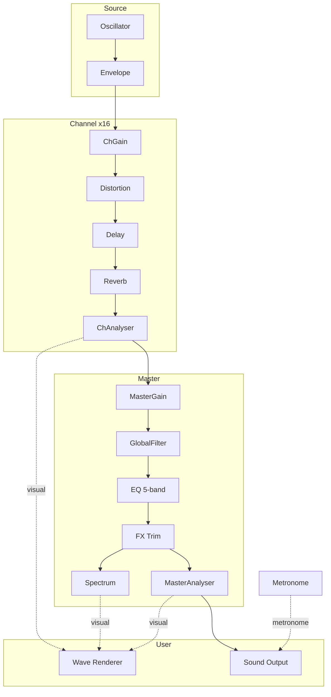

# MIDI Parser

ブラウザで動く軽量な MIDI ビジュアライザー / プレイヤーです。  
MIDIファイルを読み込み、再生しながら波形とピアノロールを確認できます。

## Demo

https://orleans-house.github.io/midi-parser/

## Features

- MIDIファイルの読み込み（`.mid`, `.midi`）
- Web Audio API 再生
- 再生 / 一時停止 / 停止
- 波形切り替え（Triangle / Sine / Square / Saw）
- 波形ミキサー（Master + 波形別音量）
- チャンネル可視化（Mute / Solo）
- ピアノロール表示（クリックシーク）

## Usage

1. 「ファイルを開く」でMIDIを選択
2. 「再生」で再生開始
3. 必要に応じて波形・音量を調整

## Audio Signal Chain

> See [`docs/signal-chain.svg`](docs/signal-chain.svg) for the detailed diagram.

## Privacy / Security

- このアプリは基本的にクライアントサイドで動作します
- MIDIファイルはサーバーへアップロードしません（静的配信前提）

## License

This project is licensed under the **ISC License**.  
See [LICENSE](./LICENSE).

This project uses **Lucide Icons** (MIT License):  
https://lucide.dev/license
