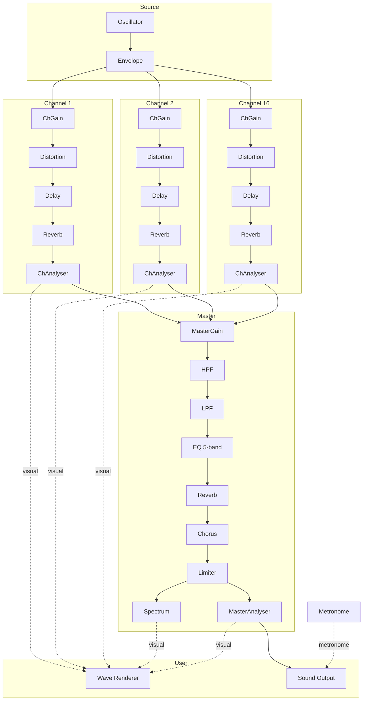

# Audio Architecture

MIDI Parser のオーディオ処理は4つの層 + User層で構成されています。

## Signal Chain

## Layer Details

### Source (`audio-source.js`)

音の生成元。MIDIのノート情報をもとに音を作り出す。

| モジュール | 説明 |
|-----------|------|
| **Oscillator** | 指定された周波数の波を生成する。波形（triangle/sine/square/sawtooth）で音色が変わる。1ノートにつき1つ作られ、使い捨て |
| **Envelope** | 音の大きさの時間変化を制御する GainNode。アタック（立ち上がり）とリリース（消え際）を滑らかにして自然な音にする |
| **Metronome** | BPMに基づくクリック音を生成。5種類の音色（click/wood/rim/beep/hihat）。音声チェーンとは独立した経路で直接 destination に出力 |

### Channel (`audio-channel.js`)

チャンネルごとの音量制御とエフェクト処理。MIDIの16チャンネル分、同じ構成のチェーンが並列に存在する。

| モジュール | 説明 |
|-----------|------|
| **ChGain** | チャンネルの音量を制御する GainNode。`waveVol`（波形ミキサーのスライダー値）× `playGate`（mute/solo状態: 1 or 0）の積で決まる |
| **Distortion** | WaveShaperNode による歪みエフェクト。dry/wet方式（OFF=素通し、ON=エフェクト音のみ） |
| **Delay** | DelayNode + フィードバックによるやまびこ効果。dry/wet方式 |
| **Reverb** | ConvolverNode + 合成IRによる残響効果。dry/wet方式 |
| **ChAnalyser** | 音声信号の観測点。信号を素通ししつつ、Wave Renderer に波形データを提供する |

### Master (`audio-master.js`)

全チャンネルを合成した後の全体処理。

| モジュール | 説明 |
|-----------|------|
| **MasterGain** | マスター音量を制御する GainNode。16チャンネルのChAnalyserからの出力がここに合流する |
| **HPF** | BiquadFilterNode (highpass)。XYパッドのX軸で周波数を操作。低音域をカットする |
| **LPF** | BiquadFilterNode (lowpass)。XYパッドのY軸で周波数を操作。高音域をカットする |
| **EQ 5-band** | 5つの BiquadFilterNode を直列接続。lowshelf / peaking×3 / highshelf で帯域別に音量調整 |
| **Reverb** | ConvolverNode + 合成IRによる残響効果。dry/wet方式。Decay(残響長)とMixを調整可能 |
| **Chorus** | DelayNode + LFO(OscillatorNode)による揺らぎ効果。dry/wet方式。Rate(速さ)、Depth(深さ)、Mixを調整可能 |
| **Limiter** | DynamicsCompressorNode。ratio=20のブリックウォールリミッター。閾値(threshold)とkneeを調整可能。ピーク超過時に音量を自動圧縮して破裂音を防ぐ |
| **Spectrum** | AnalyserNode（観測点）。`getByteFrequencyData()` で周波数領域のデータを Wave Renderer に提供。スペクトラム表示用 |
| **MasterAnalyser** | AnalyserNode（観測点）。`getByteTimeDomainData()` で時間領域のデータを Wave Renderer に提供。マスター波形表示用。また音声出力への接続点でもある |

### User (`audio-output.js`)

人間が受け取る最終出力。

| モジュール | 説明 |
|-----------|------|
| **Wave Renderer** | `requestAnimationFrame` ループ（60fps）で全Analyserからデータを取得し、Canvasに波形・スペクトラムを描画する。音声処理には一切関与しない |
| **Sound Output** | `audioCtx.destination`（スピーカー出力）。MasterAnalyser と Metronome の2系統から音声が届く |

## Orchestrator (`audio-engine.js`)

各層を呼び出して再生を管理するエントリーポイント。再生開始時に各層のビルド関数を順に呼び出し、ノートスケジューラ（15秒先読み、200msポーリング）でOscillatorを生成・発音する。一時停止・再開・停止の状態管理もここで行う。
